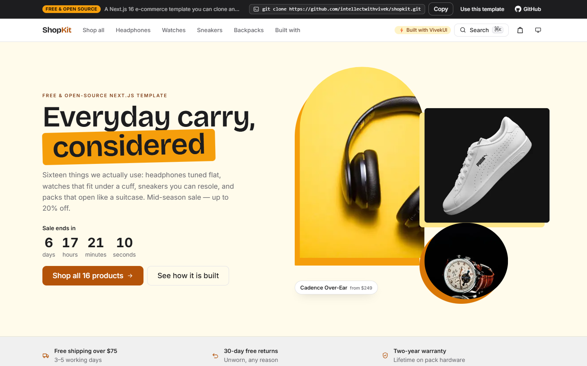

<div align="center">

# ShopKit

**A free, open-source Next.js 16 e-commerce template.**
Sixteen products, a cart drawer, ⌘K search, faceted filters, sparkline charts and a four-step checkout — built entirely with [VivekUI](https://ui.vivekkumarsingh.in/docs?utm_source=vivekui-template&utm_campaign=ecommerce&utm_medium=readme), a React component library with **zero runtime dependencies**.

[](https://nextjs.org)
[](https://react.dev)
[](https://www.typescriptlang.org)
[](https://www.npmjs.com/package/@the_viveksingh/vivek-ui)
[](#zero-runtime-dependencies)
[](LICENSE)

### [**View the live demo →**](https://shopkit.vivekkumarsingh.in)

[**Use this template**](https://github.com/intellectwithvivek/shopkit/generate) ·
[**Clone it**](#quick-start) ·
[**Deploy it**](#deploy) ·
[**Components used**](https://shopkit.vivekkumarsingh.in/built-with)



</div>

---

## What is in it

| Route | What it does |
|---|---|
| `/` | Storefront: promo `Countdown`, category tiles, a trending row with 14-day sales **sparklines**, best-sellers grid, press logos, testimonials, newsletter and FAQ |
| `/shop` | All 16 products, filtered by category, price range, minimum rating and stock — plus sort, pagination, loading skeletons and an empty state |
| `/product/[slug]` | 16 statically prerendered pages: image carousel with thumbnails, a **30-day price-history sparkline**, specs table, reviews and related products |
| `/checkout` | Four-step `Stepper` — address → shipping → payment → review — then an order number and status `Timeline`. Entirely mocked |
| `/built-with` | Every VivekUI component used on the site, deep-linked to its documentation |

Also included: `sitemap.ts`, `robots.ts`, `public/llms.txt`, a generated Open Graph image, and JSON-LD for `Product`, `Offer`, `AggregateRating`, `ItemList`, `BreadcrumbList` and `FAQPage`.

> [!NOTE]
> **This is a demo store.** No payment provider is connected, nothing is ever dispatched, and the catalog in `data/products.ts` is mock data. The checkout validates input and totals correctly, then shows an example confirmation.

## Quick start

Requires **Node.js 20.9+** (22 LTS recommended).

```bash
git clone https://github.com/intellectwithvivek/shopkit.git
cd shopkit
npm install
npm run dev
```

Open <http://localhost:3000>.

```bash
npm run build   # production build
npm start       # serve the build
npm run lint    # eslint
```

Starting a real project rather than reading this one? Use
**[Use this template](https://github.com/intellectwithvivek/shopkit/generate)** instead of
cloning — you get a fresh repository with no git history attached to it.

## Deploy

[](https://vercel.com/new/clone?repository-url=https%3A%2F%2Fgithub.com%2Fintellectwithvivek%2Fshopkit)

There is nothing to configure — no environment variables, no database, no API keys.

**One thing to change.** Set `SITE_URL` in [`lib/site.ts`](lib/site.ts) to your own origin:

```ts
export const SITE_URL = 'https://your-domain.com'
```

Everything URL-shaped derives from it — `metadataBase`, canonical tags, `sitemap.xml`,
`robots.txt` and every JSON-LD `@id`. Leave it pointing at this demo and search engines
will be told your pages are copies of it.

## Making it yours

Almost everything lives in two files.

- **`data/products.ts`** — the catalog. Each product is one object: name, price, `comparePrice`, rating, specs, images and review text. The sales and price-history series feeding the sparklines are generated from a seeded PRNG, so they are deterministic and hydration-safe; swap `salesSeries`/`priceSeries` for real numbers when you have them.
- **`app/globals.css`** — the art direction. The amber accent is four CSS custom properties at the top of the file; change `--vk-color-primary` and its ramp to rebrand the entire site, VivekUI components included.

VivekUI wraps every one of its own selectors in `:where()`, which has zero specificity — so a single flat class of your own always wins, and there is no `!important` anywhere in this project.

## Zero runtime dependencies

```json
"dependencies": {
  "@the_viveksingh/vivek-ui": "^0.5.0",
  "next": "16.3.2",
  "react": "19.2.8",
  "react-dom": "19.2.8"
}
```

That is the whole list. No Tailwind, no shadcn, no component CLI, no drawer library, no combobox library, no charting library. The cart `Drawer`, the ⌘K `CommandPalette` and both `Sparkline` charts all come from the same package.

Most of the site is a Server Component. Only the cart, the shop filters, the ⌘K palette, the gallery and the checkout ship JavaScript.

## Powered by VivekUI

```bash
npm i @the_viveksingh/vivek-ui
```

**91 React components · 6 SVG charts · zero runtime dependencies.** One install, one CSS import, no config.

[Documentation](https://ui.vivekkumarsingh.in/docs?utm_source=vivekui-template&utm_campaign=ecommerce&utm_medium=readme) ·
[npm](https://www.npmjs.com/package/@the_viveksingh/vivek-ui) ·
[GitHub](https://github.com/intellectwithvivek/vivek_UI) ·
[Vivek Kumar Singh](https://vivekkumarsingh.in/?utm_source=vivekui-template&utm_campaign=ecommerce&utm_medium=readme)

See [`/built-with`](https://shopkit.vivekkumarsingh.in/built-with) on the live demo for every component used here, mapped to the part of the site it appears in.

## Licence

[MIT](LICENSE). Use it commercially, change anything, ship it.

The "Built with VivekUI" credit in the footer and navbar is **removable** — it is a couple of lines in `components/site-footer.tsx` and `components/site-navbar.tsx`. Leaving it in, or starring the repository, is appreciated but never required.
